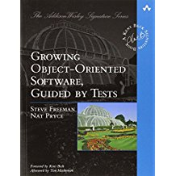

class: centre, middle
# Behavioural Unit Testing

---
class: two-column
#TDD Schools
.column[
**Chicago/Detroit School**
* aka Classical or State-Based
* Tests state (input/output)
* Few mocks
* Much test data
* Test fixture per state
<br><br>

]
.column[
<br>
**London School**
* aka Mockist or Interaction
* Tests interaction/collaberation
* Many mocks
* Little test data
* Test fixture per class
<br><br>

]
---
class: two-column
#TDD Styles
.column[
**Inside-out**
* Start with a unit test
* Components are built in any<br>order
* Components are integrated<br>at end
* Acceptance testing optional
]
.column[
<br>
**Outside-in**
* Start with an acceptance test
* Components built from outside (UI)
* Components are integrated incrementally
<br><br>
* Acceptance testing mandatory
]
---
#Testing-Style Quadrants
<table class="quadrants">
    <tr>
        <td class="titles">
            <div>Inside-out</div>
        </td>
        <td></td>
        <td></td>
    </tr>
    <tr>
        <td class="titles">
            <div>Outside-in</div>
        </td>
        <td></td>
        <td></td>
    </tr>
    <tr class="titles">
        <td class="titles"></td>
        <td>Mockist testing</td>
        <td>State based testing</td>
    </tr>
</table>

---
#Case study
We work for a publishing house developing a *Reviews-API* which receives book reviews and stores them.
The request is in an industry standard API...
```http
Content-type: application/json
Referer: https://literaryreview.co.uk/
```
```json
{
    "isbn": "9788175257665",
    "title": "War and Peace",
    "author": "Leo Tolstoy",
    "reviewer": "Karen Castle",
    "sections": [
        {
            "name": "Title",
            "text": "A Classic of our Times"
        },
        {
            "name": "SubTitle",
            "text": "Karen Castle reviews Tolstoy's latest work"
        },
        {
            "name": "Body",
            "text": "Blah blah blah"
        }
    ]
}
```
---
#Requirements
When a review is received it will be validated. The table below shows the validation
and which status code and message to respond with on failure.

| Validation                                    | Status Code    | Error Message                   |
|-----------------------------------------------|----------------|---------------------------------|
| The `Content-type` must be `application/json` | 415            | Incorrect content type          |
| The `Referer` must have a valid URI format    | 400            | Bad referer uri                 |
| The `isbn` must be 13 numeric characters      | 400            | Invalid ISBN                    |

---
#Requirements (cont.)
A valid review will be saved to our database using the `ISaveReviews` interface which has the following signature:

```c#
public interface ISaveReviews
{
    void Insert(ReviewDto dto);
}

public class ReviewDto
{
    public long ISBN { get; set; }
    public string Reviewer { get; set; }
    public string Uri { get; set; }
    public string Text { get; set; }
}
```

The `Text` property shall be formatted as follows:

```html
&lt;h1&gt;Title&lt;/h1&gt;
&lt;h2&gt;SubTitle&lt;/h2&gt;
&lt;p&gt;Body&lt;/p&gt;
```

After the save a status code 201 is sent with no error message.
---
#Inside-Out Mockist Testing
<table class="quadrants">
    <tr>
        <td class="titles">
            <div>Inside-out</div>
        </td>
        <td class="selected"></td>
        <td></td>
    </tr>
    <tr>
        <td class="titles">
            <div>Outside-in</div>
        </td>
        <td></td>
        <td></td>
    </tr>
    <tr class="titles">
        <td class="titles"></td>
        <td>Mockist testing</td>
        <td>State based testing</td>
    </tr>
</table>
---
#Getting Started
Firstly I need to decide what to build. Let's write down what I need to do...

.written-text[
Validate the http headers

Validate the body

Walk the sections

Map the http headers to the ReviewDto

Map the body to the ReviewDto

Format the section to html

Map the html to ReviewDto.Text
]
---
# Deciding on my Components
.written-text[
.red-text[Validate] the http headers

.red-text[Validate] the body

.blue-text[Walk] the sections

.green-text[Map] the http headers to the ReviewDto

.green-text[Map] the body to the ReviewDto

.purple-text[Format] the section to html

.green-text[Map] the html to ReviewDto.Text
]

Therefore
.written-text[
public interface .red-text[IReviewValidator];

public interface .blue-text[ISectionWalker];

public interface .green-text[IReviewDtoMapper];

public interface .purple-text[IReviewHtmlFormatter];
]
---
#Conclusions: Inside-Out Mockist Testing
<table class="quadrants">
    <tr>
        <td class="titles">
            <div>Inside-out</div>
        </td>
        <td class="selected">
            <ul>
                <li>Test complexity</li>
                <li>Tests do not demonstrate behaviour</li>
                <li>Tight coupling to code</li>
                <li>Difficult to refactor</li>
                <li>Too many tests</li>
                <li>Testing incidentals (e.g. Mapper)</li>
            </ul>
        </td>
        <td></td>
    </tr>
    <tr>
        <td class="titles">
            <div>Outside-in</div>
        </td>
        <td></td>
        <td></td>
    </tr>
    <tr class="titles">
        <td class="titles"></td>
        <td>Mockist testing</td>
        <td>State based testing</td>
    </tr>
</table>
---
#What's worse about behavioural testing
* Test case organisation
    * Fix with feature folder
    * Fix with coverage tool
* Tight coupling to constructors
    * Fix with builders
* Cascading test failures
    * No fix but is this such a bad thing?
---
#But, Hang-On, you used a Mock
When should I use a mock

*Rarely*

No really

*Yes, really. But if you must have a list....*

* When something is slow
    * Database
    * Remote call
* When something is difficult to set-up
    * Database
    * Statics (`DateTime.Now`)
    * Third-party code
* When something is unreliable
    * Remote call
* When behaviour is very complex (very rare)
---
#That's only half the story.
All I did was take a sut designed in mocks style and improve tests to a behavioural style
TDD is about design at least as much as testing
How you go about TDD has a direct effect on the design if your code
If you mostly test interactions, you'll get more interactions.
If you mostly test behaviours, you'll get more behaviours.
Now start from scratch and do TDD in fully behavioural style.
---
#The Four Elements of Simple Design
In XP, Kent Beck defined Simple Design as
    1. Runs all the tests
    2. Has no duplicated logic
    3. States every intention important to the programmer
    4. Has the fewest possible classes and methods
The order is important

Over time this has become
    1. Passes the tests
    2= No duplication
    2= Reveals intent
    3. Fewest elements
---
#Further reading
* **Ron Jeffries**<br>
    * *Thoughts on Mocks*<br>
        [http://ronjeffries.com/articles/015-11/tdd-mocks/](http://ronjeffries.com/articles/015-11/tdd-mocks/)

* **Jason Gorman**<br>
    * *Classical TDD or "London School"*<br>
        [http://codemanship.co.uk/parlezuml/blog/?postid=987](http://codemanship.co.uk/parlezuml/blog/?postid=987)

* **Ken Scambler**<br>
    * *To Kill a Mockingtest*<br>
        [http://rea.tech/to-kill-a-mockingtest/](http://rea.tech/to-kill-a-mockingtest/)<br><br>
    * *Imagine a World without Mocks*<br>
        [https://www.slideshare.net/kenbot/imagine-a-world-without-mocks](https://www.slideshare.net/kenbot/imagine-a-world-without-mocks)

* **Martin Fowler**<br>
    * *Beck Design Rules*<br>
        [https://martinfowler.com/bliki/BeckDesignRules.html](https://martinfowler.com/bliki/BeckDesignRules.html)

* **J. B. Rainsberger (JBrains)**<br>
    * *The Four Elements of Simple Design*<br>
        [http://blog.jbrains.ca/permalink/the-four-elements-of-simple-design](http://blog.jbrains.ca/permalink/the-four-elements-of-simple-design)
    * *Putting An Age-Old Battle To Rest*<br>
        [http://blog.thecodewhisperer.com/permalink/putting-an-age-old-battle-to-rest](http://blog.thecodewhisperer.com/permalink/putting-an-age-old-battle-to-rest)